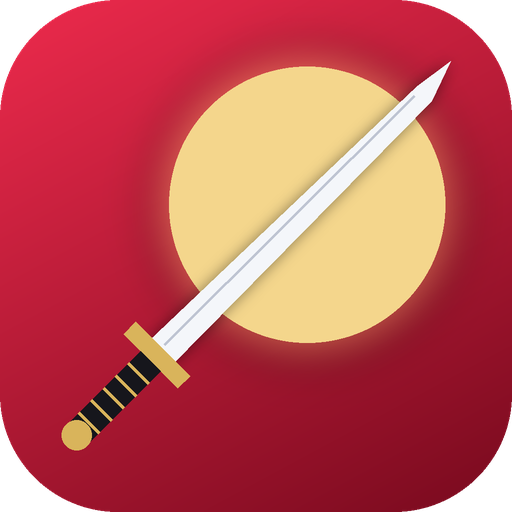
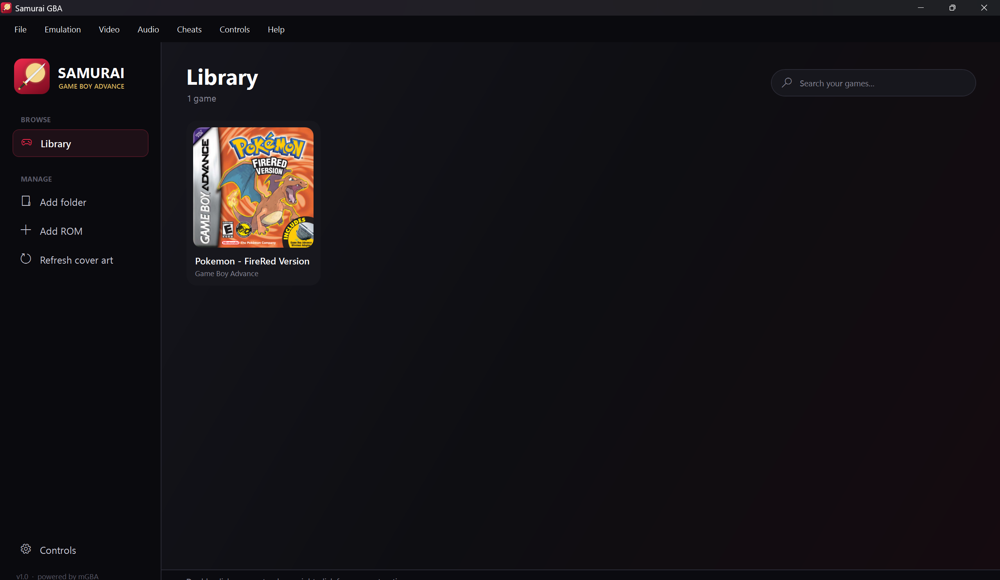
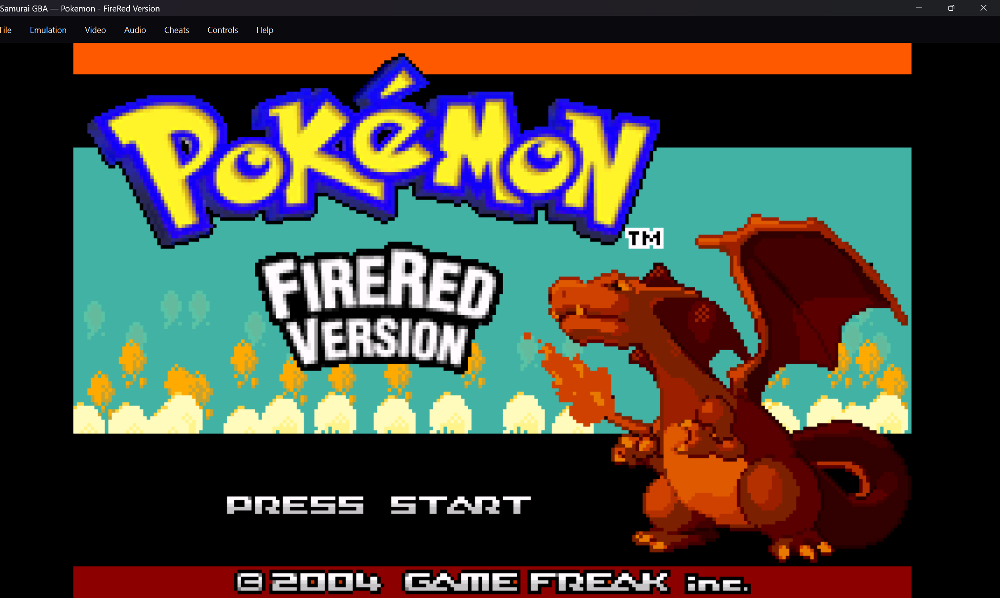

<div align="center">



# SAMURAI GBA

**A modern Game Boy Advance emulator front end for Windows**

<sub>Sleek library · box art · cheats · upscaling filters · rebindable controls</sub>

<br/>


<br/>

[**Download**](../../releases/latest) · [Features](#-features) · [Build from source](#-build-from-source) · [Controls](#-default-controls)

</div>

---

## ✨ Features

| | |
|---|---|
| 🎴 **Game library** | Add folders or drop ROMs onto the window. Search, sort and launch from a card grid. |
| 🖼️ **Cover art** | Box art is fetched automatically from the libretro-thumbnails database. Use your own image with right-click → *Set custom cover*. |
| 🎮 **Controls** | Fully rebindable keyboard **and** Xbox / XInput gamepad bindings. Hold-to-fast-forward. |
| 🧪 **Cheats** | Per-game cheat manager. GameShark, Action Replay and CodeBreaker codes, toggled on and off. |
| 🔍 **Upscaling** | Nearest · Bilinear · Sharp bilinear · CRT scanlines · GBA LCD grid, plus integer scaling and fullscreen. |
| 💾 **Saves** | Battery saves, 5 save-state slots per game, screenshots. |
| 🔊 **Audio** | Volume and mute, low-latency output. |
| 🌑 **Modern UI** | Dark crimson-and-gold theme with a sidebar, hover effects and styled menus. |

> Powered by the excellent [**mGBA**](https://mgba.io) emulation core (via libretro), so game compatibility comes from mGBA.

## 📸 Screenshots

<div align="center">

| Library | In game |
|:---:|:---:|
|  |  |

</div>


## 📥 Install

1. Open the [**Releases**](../../releases/latest) page and download `SamuraiGBA-Setup.exe`.
2. Run the installer.
3. Launch **Samurai GBA**, click **Add folder**, and point it at your ROMs.

The app bundles the mGBA core. If it is missing, Samurai GBA offers to download it on first launch.

## ⌨️ Default controls

| GBA | Keyboard | Gamepad |
|:---:|:---:|:---:|
| D-Pad | Arrow keys | D-Pad / left stick |
| A | `X` | B |
| B | `Z` | A |
| L / R | `A` / `S` | LB / RB |
| Start | `Enter` | Start |
| Select | `Backspace` | Back |

Everything is rebindable under **Controls**.

| Hotkey | Action |
|:---:|:---|
| `Tab` (hold) | Fast-forward |
| `P` | Pause |
| `F5` / `F8` | Quick save / quick load |
| `F11` | Fullscreen |
| `F12` | Screenshot |
| `Esc` | Back to library |

## 🛠️ Build from source

You need Windows, the [.NET 8 SDK](https://dotnet.microsoft.com/download) and [Inno Setup 6](https://jrsoftware.org/isinfo.php).

```powershell
winget install Microsoft.DotNet.SDK.8
winget install JRSoftware.InnoSetup

git clone https://github.com/YOUR_USERNAME/SamuraiGBA.git
cd SamuraiGBA
powershell -ExecutionPolicy Bypass -File .\build.ps1
```

The installer is written to `installer\Output\SamuraiGBA-Setup.exe`. To just run the app:

```powershell
dotnet run -c Release
```

**No Windows PC?** Push to GitHub: the included workflow builds the installer and attaches it to the run.

## 🧩 How it works

```
 WPF front end (C#)            libretro API              mGBA core
┌────────────────────┐       ┌──────────────┐       ┌────────────────┐
│ Library · UI       │       │ video frames │       │ ARM7TDMI CPU   │
│ Cheats · Controls  │ <───> │ audio        │ <───> │ GBA PPU / APU  │
│ Filters · Saves    │       │ input · cheats│      │ save states    │
└────────────────────┘       └──────────────┘       └────────────────┘
```

The front end loads `mgba_libretro.dll`, runs it on a dedicated emulation thread, and handles rendering, audio, input, cheats and the game library.

## 📁 Where your data lives

`%AppData%\SamuraiGBA` holds settings, the library, saves, save states, cheats and cover art. Screenshots go to `Pictures\Samurai GBA`.

## ⚠️ Legal

Samurai GBA does **not** include any games or BIOS files. Only play games you own. Cover art comes from the [libretro-thumbnails](https://github.com/libretro-thumbnails/libretro-thumbnails) project. mGBA is © endrift and licensed under MPL-2.0. Samurai GBA is not affiliated with Nintendo.

## 📄 License

The Samurai GBA front end is released under the [MIT License](LICENSE). The mGBA core keeps its own MPL-2.0 license.

<div align="center"><sub>Made by Samurai-dev and too much Passion</sub></div>
